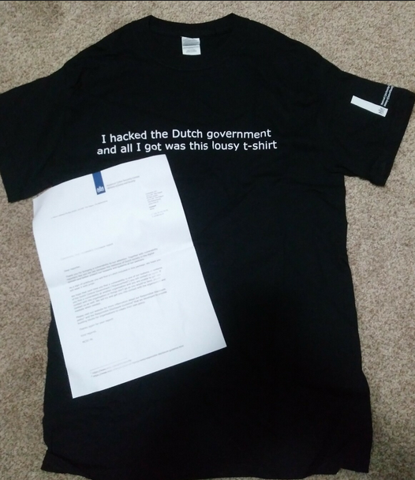
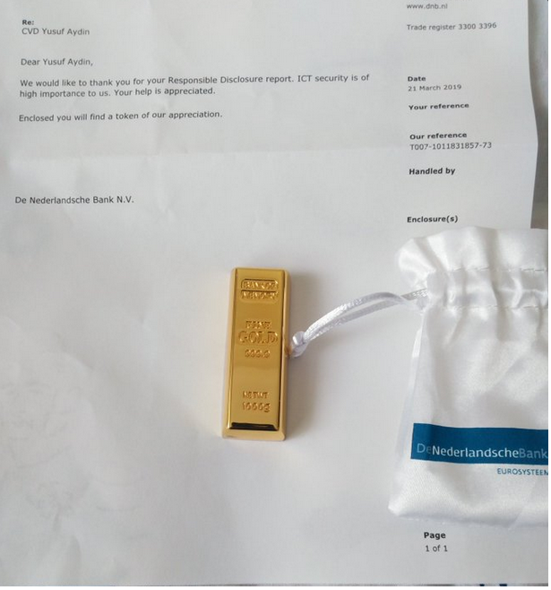
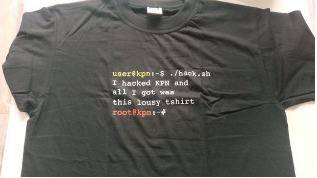
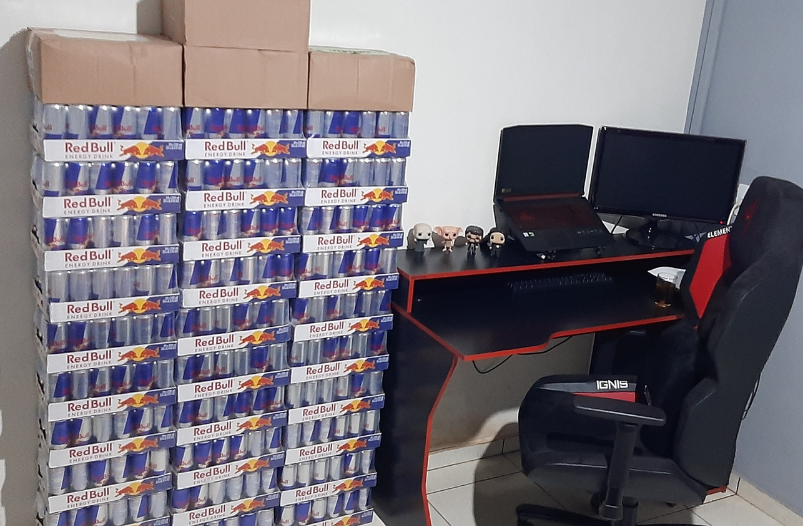
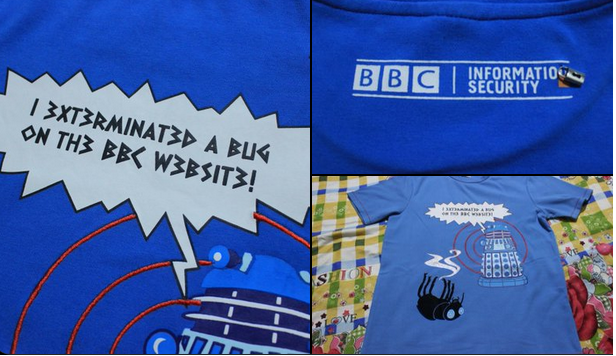
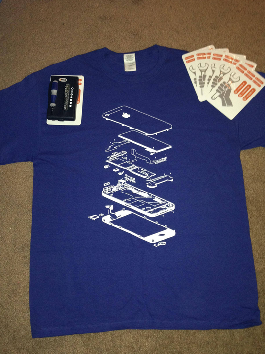

<h1 align="center">Awesome Bounty Rewards</h1>

A currated list of BBPs and VDPs that offer awesome/unique rewards

### Dutch Government

<table>
   <tr>
      <td align="center">
      <a href="https://nullpxl.com/post/how-a-simple-bug-can-be-dangerous/">Image source<a>
      </td>
      <td align="center">
      <a href="https://www.government.nl/topics/cybercrime/fighting-cybercrime-in-the-netherlands/responsible-disclosure">Responsible Disclosure<a>
      </td>
   </tr>
</table>

### UK Ministry Of Defence 

<table>
   <tr>
      <td align="center">
      <a href="https://twitter.com/_justYnot/status/1432654180850626563">Image source<a>
      </td>
      <td align="center">
      <a href="https://www.gov.uk/guidance/report-a-vulnerability-on-an-mod-system">Report a vulnerability on an MOD system <a>
      </td>
   </tr>
</table>

### De Nederlandsche Bank

Notice: Its just a USB stick and not a 1000g gold nugget

<table>
   <tr>
      <td align="center">
      <a href="https://twitter.com/h1_yusuf/status/1114119249876926464">Image source<a>
      </td>
      <td align="center">
      <a href="https://www.dnb.nl/en/privacy-and-security/report-vulnerability/">Report vulnerability<a>
      </td>
   </tr>
</table>

### Dutch Tax Administration

<table>
   <tr>
      <td align="center">
      <a href="https://twitter.com/rootpentesting/status/1362098621567664134">Image source<a>
      </td>
      <td align="center">
      <a href="https://www.belastingdienst.nl/wps/wcm/connect/bldcontenten/standaard_functies/individuals/contact/data-leak-vulnerability-abuse-computer-systems/coordinated-vulnerability-disclosure">Coordinated Vulnerability Disclosure<a>
      </td>
   </tr>
</table>

### KPN

Source: https://twitter.com/rootpentesting/status/906068477856931844 

<table>
   <tr>
      <td align="center">
      <a href="https://twitter.com/rootpentesting/status/906068477856931844">Image source<a>
      </td>
      <td align="center">
      <a href="https://developer.kpn.com/responsible-disclosure">Responsible Disclosure<a>
      </td>
   </tr>
</table>

### Redbull

<table>
   <tr>
      <td align="center">
      <a href="https://twitter.com/locs3c/status/1453367388251037698">Image source<a>
      </td>
      <td align="center">
      <a href="https://app.intigriti.com/programs/redbull/redbull/detail">Bug Bounty Program<a>
      </td>
   </tr>
</table>

### Yahoo

<table>
   <tr>
      <td align="center">
      <a href="https://twitter.com/theCyberGuy0/status/1479757264806371328">Image source<a>
      </td>
      <td align="center">
      <a href="https://hackerone.com/yahoo">Bug Bounty Program<a>
      </td>
   </tr>
</table>

### BBC

<table>
   <tr>
      <td align="center">
      <a href="https://twitter.com/tinurock007/status/1188859704077799424">Image source<a>
      </td>
      <td align="center">
      <a href="https://www.bbc.com/backstage/security-disclosure-policy">Security Disclosure Policy<a>
      </td>
   </tr>
</table>

### GitHub

<table>
   <tr>
      <td align="center">
      <a href="https://github.com/joernchen">Image source<a>
      </td>
      <td align="center">
      <a href="https://bounty.github.com/">GitHub Security Bug Bounty<a>
      </td>
   </tr>
</table>

### iFixit

<table>
   <tr>
      <td align="center">
      <a href="http://kaoticcreations.blogspot.com/2013/12/xmas-gifts-from-ifixitcom-for-bug-bounty.html">Image source<a>
      </td>
      <td align="center">
      <a href="https://www.ifixit.com/Info/Responsible_Disclosure">Responsible Disclosure<a>
      </td>
   </tr>
</table>
